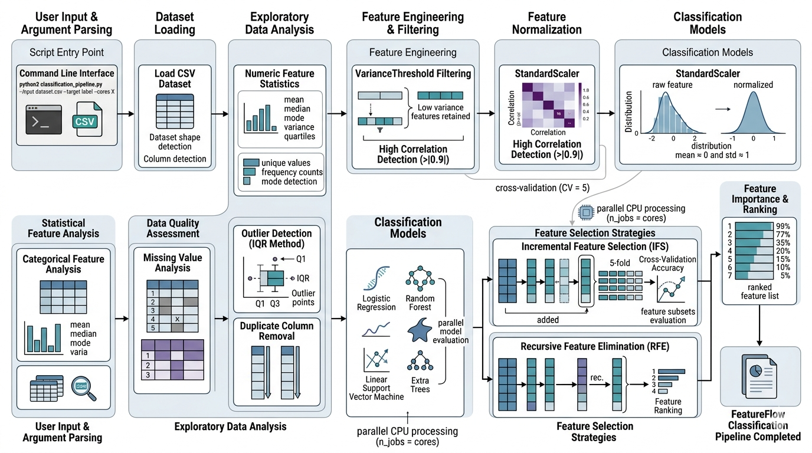
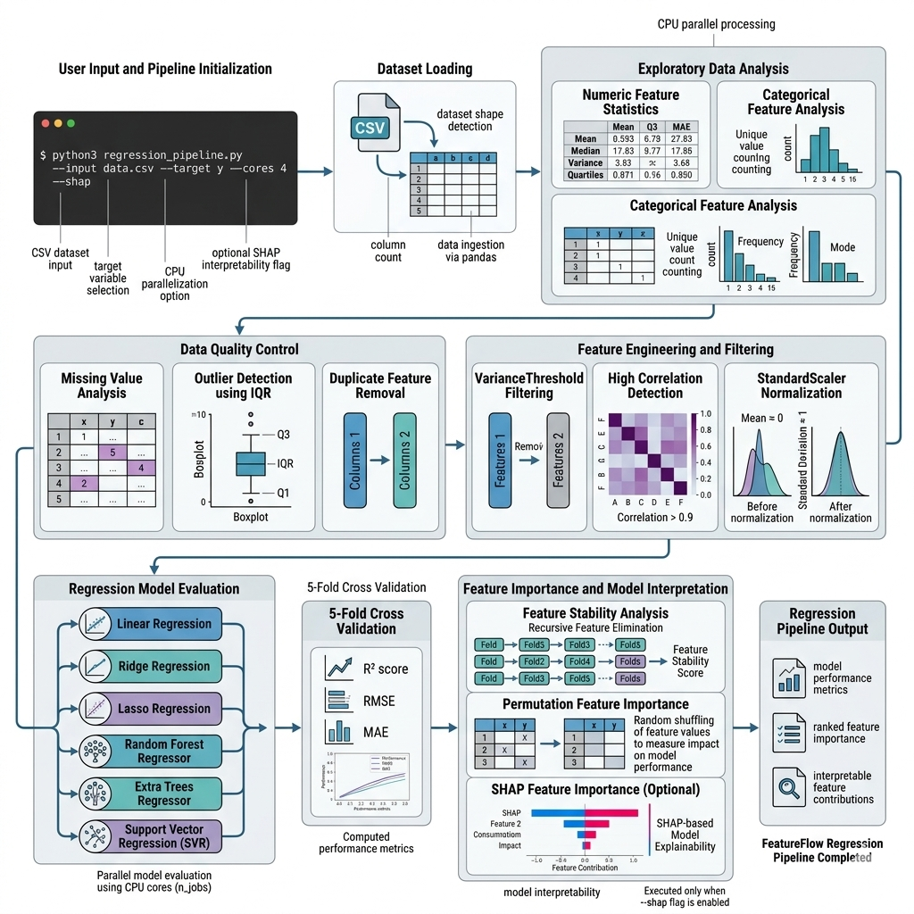

---

# FeatureFlow-ML

A machine learning framework providing structured **classification and regression pipelines** with automated preprocessing, feature engineering, model training, and evaluation utilities.

---

# 🎯 Overview

FeatureFlow-ML simplifies the development of machine learning workflows by providing ready-to-use pipelines for both **classification** and **regression** tasks. The framework reduces repetitive implementation while allowing flexibility for custom experimentation.

**Key capabilities**

* Automated preprocessing and feature handling
* Support for multiple machine learning algorithms
* Integrated model evaluation utilities
* Modular design for customization
* Optional multi-core execution for improved performance

---

# 📦 PyPI Package

FeatureFlow-ML is available on PyPI and can be installed directly using pip.

**PyPI Page**
[https://pypi.org/project/featureflow-ml/0.1.0/](https://pypi.org/project/featureflow-ml/0.1.0/)

Install using pip:

```bash
pip install featureflow-ml
```

or in Jupyter / Google Colab:

```python
!pip install featureflow-ml
```

---

# 📋 Table of Contents

* Quick Start
* Installation
* Classification Pipeline
* Regression Pipeline
* Alternative Script Execution
* CPU Core Usage
* Dependencies
* Repository Structure
* Version Information

---

# 🚀 Quick Start

## Classification Example

```python
from classification_pipeline import ClassificationPipeline

pipeline = ClassificationPipeline(model_type='random_forest')
pipeline.fit(X_train, y_train)

predictions = pipeline.predict(X_test)

accuracy = pipeline.evaluate(X_test, y_test)
print(f"Accuracy: {accuracy:.4f}")
```

---

## Regression Example

```python
from regression_pipeline import RegressionPipeline

pipeline = RegressionPipeline(model_type='xgboost')
pipeline.fit(X_train, y_train)

predictions = pipeline.predict(X_test)

r2_score = pipeline.evaluate(X_test, y_test)
print(f"R² Score: {r2_score:.4f}")
```

---

# 📦 Installation

## Prerequisites

* Python 3.8+
* pip or conda

---

## Install from PyPI (Recommended)

```bash
pip install featureflow-ml
```

---

## Install from Source

```bash
git clone https://github.com/lovekaushik899/FeatureFlow-ML.git
cd FeatureFlow-ML
pip install -r requirements.txt
```

---

# Classification Pipeline

The classification pipeline performs preprocessing, feature handling, model training, and evaluation using multiple supported algorithms.



*Figure 1. Workflow of the FeatureFlow classification pipeline.*

---

# Regression Pipeline

The regression pipeline follows a similar architecture adapted for regression tasks, supporting gradient boosting and other regression algorithms.



*Figure 2. Workflow of the FeatureFlow regression pipeline.*

---

# Alternative Usage (Direct Script Execution)

Apart from installing the package through pip, users may also **directly copy the scripts from the repository and execute them independently**.

This option is useful in environments where installing packages is restricted or when pipelines are used in standalone workflows.

### Classification

```bash
python3 classification_pipeline.py --input file.csv --target label --cores x
```

### Regression

```bash
python3 regression_pipeline.py --input file.csv --target label --cores x
```

---

# CPU Core Usage

The `--cores` parameter enables optional multi-threaded execution.

* If `--cores` is **not specified**, the pipeline runs using **1 CPU thread by default**.
* If a value is provided, the pipeline utilizes the specified number of CPU cores.

This design allows FeatureFlow-ML to operate efficiently across different environments, including:

* Personal systems or resource-constrained environments
* High-performance computing (HPC) environments with multiple CPU cores

---

# Dependencies

Install dependencies manually if running scripts directly:

```bash
pip install numpy pandas scikit-learn xgboost lightgbm matplotlib seaborn
```

### Dependency Overview

| Library              | Purpose                                       |
| -------------------- | --------------------------------------------- |
| numpy                | Numerical computations                        |
| pandas               | Data manipulation and tabular data processing |
| scikit-learn         | Core machine learning algorithms              |
| xgboost              | Gradient boosting implementation              |
| lightgbm             | Efficient gradient boosting                   |
| matplotlib / seaborn | Visualization utilities                       |

---

# Repository Structure

```
FeatureFlow-ML
│
├── FeatureFlow_Classification.png
├── FeatureFlow_Regression.png
├── classification_pipeline.py
├── regression_pipeline.py
├── requirements.txt
├── pyproject.toml
├── LICENSE
└── README.md
```

---

# Version Information

**Version:** 0.1.0
**PyPI:** [https://pypi.org/project/featureflow-ml/0.1.0/](https://pypi.org/project/featureflow-ml/0.1.0/)
**Last Updated:** 2026-03-09

**Maintainer**
Love Kaushik
GitHub: [https://github.com/lovekaushik899](https://github.com/lovekaushik899)

---
